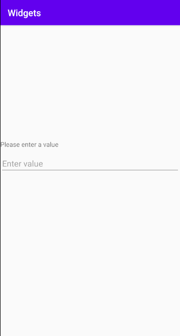
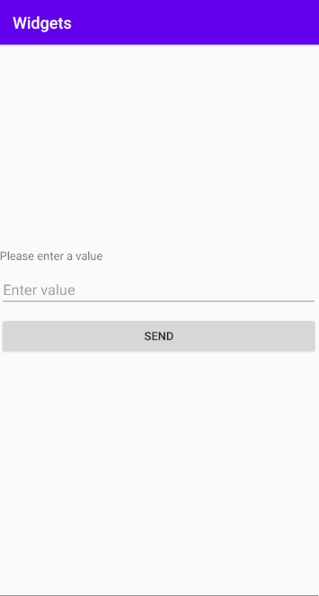

# Rapport

Jag började med att forka appen sedan öppna den i android studios.

Jag ändrade sedan den existerande layouten till Linear Layout istället för Constraint Layout genom att byta ut koden i `activity_main.xml` så att det ser ut som kodsnutten nedan.

```xml
<?xml version="1.0" encoding="utf-8"?>
<LinearLayout xmlns:app="http://schemas.android.com/apk/res-auto"
    xmlns:tools="http://schemas.android.com/tools"
    xmlns:android="http://schemas.android.com/apk/res/android"
    android:layout_width="match_parent"
    android:layout_height="match_parent"
    android:orientation="vertical"
    tools:context=".MainActivity">

    ...

</LinearLayout>
```

Sedan la jag till en `TextView` widget och en `EditText` widget och satte 250dp som värde till `layout_marginTop` på `TextView` widgeten så att alla widgets under den mer centrerat på skärmen som bild nedan visar.



Efter det la jag till en knapp i form av `Button` widget. Jag ändrade även så att övriga widgets har en padding på 10dp för att ge mer utrymme och gjorde så att knappen har samma bredd som sin parent. Nedan är den färdiga koden för de tre widgets samt en bild på hur den färdiga layouten ser ut.

```xml
...
    <TextView
        android:id="@+id/myTxtView"
        android:layout_width="wrap_content"
        android:layout_height="wrap_content"
        android:layout_marginTop="250dp"
        android:text="Please enter a value" />

    <EditText
        android:id="@+id/myEditTxt"
        android:hint="Enter value"
        android:layout_width="match_parent"
        android:layout_height="wrap_content"
        android:layout_marginTop="10dp" />

    <Button
        android:id="@+id/buttonSend"
        android:layout_height="wrap_content"
        android:layout_width="match_parent"
        android:layout_marginTop="10dp"
        android:text="SEND" />
...
```

